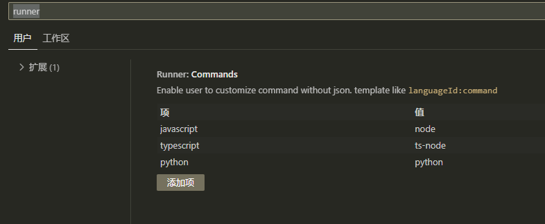

# Runner

This is a simple runner for the file.

## features

- [x] run script file
- [x] The plug-in automatically goes to the folder where the current file is located before running the command
- [x] setting with json file!
- [x] add custom command
- [x] support multi language, like javascript, python, typescript.

## usage

`ctrl+alt+r` to run the current file.

or command the `Runner: Run` in command palette.

## setting

you can add command easily without editing json file.

