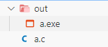
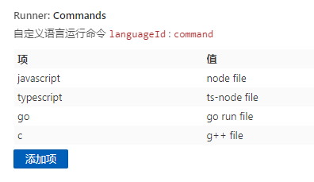

# Runner

简单的运行脚本的插件，支持多种语言，如：javascript, python, typescript.

## features

- 会自动跳转到当前文件的目录下运行
- 方便的自定义命令
- 支持多种语言
  - js, ts
  - go, c(objective-c)

对于 c 语言的运行进行了优化，将编译后的程序都放到同目录的 `out` 文件夹下，方便管理

> 需要注意的是，文件要改成准确的 languageId。
> 在右下角的位置
> 

## usage

`ctrl+alt+r`：快捷键运行当前文件，

或者 `Ctrl+shift+p` 选择 `Runner: Run` 命令

或者 点击右上角运行图标

## setting

你可以非常轻松的设置一个自定义的命令

## continue...

- [ ] 运行 workspace 下的项目
