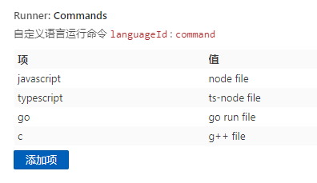
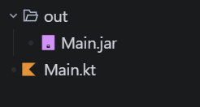

# File Runner


A lightweight VS Code file runner extension, based on command-line. Supports quick execution of single-file code with built-in support for multiple programming languages, while allowing users to customize run commands.

## Features

- **One-click Run**: Quickly run the current file using the shortcut `Ctrl+Alt+R` (Mac: `Cmd+Alt+R`) or by clicking the run button in the top-right corner of the editor
- **Multi-language Support**: Built-in support for JavaScript, TypeScript, Python, Go, C, C++, Rust, Kotlin, and more
- **Compiled Language Support**: Automatically handles the compilation process, compiling before running, with compilation outputs saved in the `out` directory
- **Custom Commands**: Supports user-defined run commands and compile commands
- **Smart Recognition**: Automatically selects the appropriate execution method based on the file's Language ID

## Supported Languages

### Interpreted Languages (Direct Run)

| Language      | Default Command            |
| ------------- | -------------------------- |
| JavaScript    | `node <file>`            |
| TypeScript    | `ts-node <file>`         |
| Python        | `python <file>`          |
| Go            | `go run <file>`          |
| Kotlin Script | `kotlinc -script <file>` |

### Compiled Languages (Compile then Run)

| Language | Compile Command                                           | Run Command                      |
| -------- | --------------------------------------------------------- | -------------------------------- |
| C        | `gcc <file> -o <outDir>/<out>`                          | `<outDir>/<out>`               |
| C++      | `g++ <file> -o <outDir>/<out>`                          | `<outDir>/<out>`               |
| Rust     | `rustc <file> -o <outDir>/<out>`                        | `<outDir>/<out>`               |
| Kotlin   | `kotlinc <file> -include-runtime -d <outDir>/<out>.jar` | `java -jar <outDir>/<out>.jar` |

> **Note**: Objective-C files (`.m`) are recognized and processed as C language.

## Usage

### Quick Start

1. Open the code file you want to run
2. Press `Ctrl+Alt+R` (Mac: `Cmd+Alt+R`) or click the ▶️ run button in the top-right corner of the editor
3. View the terminal output

### Clear Output Directory

Run the **Clear Out Dir** command to clear the `out` folder in the current file's directory, making it easy to organize compiled output files.

## Configuration

### Direct Run Command Configuration (`runner.runCommands`)

For interpreted languages, the configuration format is `languageId: command`.

Use `<file>` as a placeholder for the file path.

```json
{
  "runner.runCommands": {
    "javascript": "node <file>",
    "typescript": "ts-node <file>",
    "python": "python <file>",
    "go": "go run <file>",
    "kotlinscript": "kotlinc -script <file>"
  }
}
```



### Compile and Run Command Configuration (`runner.compileCommands`)

For compiled languages, the following placeholders are supported:

- `<file>`: Source file path
- `<out>`: Output filename (without extension)
- `<outDir>`: Output directory

```json
{
  "runner.compileCommands": {
    "c": {
      "compile": "gcc <file> -o <outDir>/<out>",
      "run": "<outDir>/<out>"
    },
    "cpp": {
      "compile": "g++ <file> -o <outDir>/<out>",
      "run": "<outDir>/<out>"
    },
    "rust": {
      "compile": "rustc <file> -o <outDir>/<out>",
      "run": "<outDir>/<out>"
    },
    "kotlin": {
      "compile": "kotlinc <file> -include-runtime -d <outDir>/<out>.jar",
      "run": "java -jar <outDir>/<out>.jar"
    }
  }
}
```

### Compile Output Directory (`runner.compileOutDir`)

Set the name of the compilation output directory (relative path), default is `out`.

```json
{
  "runner.compileOutDir": "out"
}
```

### C Language Project Structure Example


### Kotlin Compiled Project Structure Example



## How to Get Language ID


In VS Code, click the file type indicator in the bottom-right corner to view the current file's Language ID.

## Keyboard Shortcuts

| Shortcut                       | Command  | Description          |
| ------------------------------ | -------- | -------------------- |
| `Ctrl+Alt+R` / `Cmd+Alt+R` | Run Code | Run the current file |

## Changelog

See [CHANGELOG.md](CHANGELOG.md)

## License

[MIT](LICENSE)
